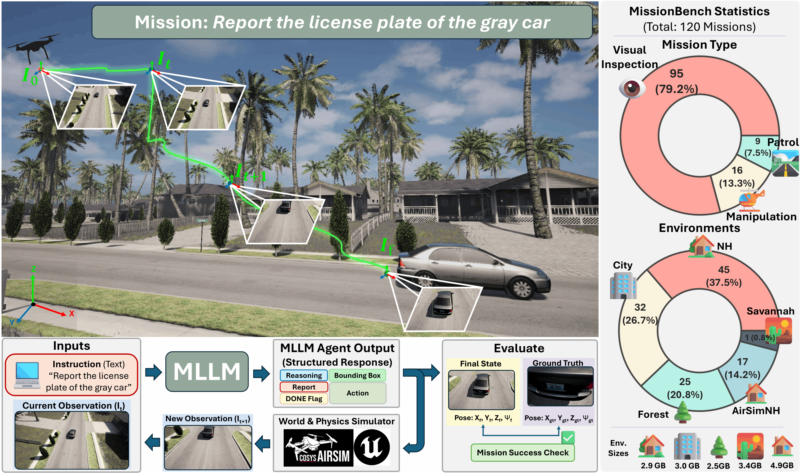

---

# MissionBench: Zero-Shot Mission-Level Evaluation for Aerial MLLM Agents

<p align="center">
  <a href="https://gomtae.github.io/publications/missionbench">
    
  </a>
  <a href="https://arxiv.org/abs/2607.22014">
    
  </a>
  <a href="https://creativecommons.org/licenses/by/4.0/">
  
  </a>
</p>

MissionBench is a UAV autonomous mission execution framework integrated with **Cosys-AirSim** and **Vision–Language Models (VLMs)** for tasks such as patrol, visual inspection, manipulation, and package delivery.
The system supports **Gemini, GPT, AWS Nova, and Anthropic models**, configurable via YAML files.

---

## Visualization



## Acknowledgments

Special thanks to [**Suman Navaratnarajah**](https://github.com/suman1209), the main contributor to this work.

## Milestone

- 2025/05/08: The official implementation of **MissionBench** is now open source.
- 2025/05/06: The official project page can be found **[HERE](https://gomtae.github.io/publications/missionbench)**.

## System Requirements

### Hardware

* **CPU:** Intel i7 (12th Generation or above)
* **GPU:** NVIDIA RTX 3050 (4 GB VRAM or higher)
* **RAM:** 16 GB or more
* **Storage:** Minimum 250 GB free space

### Operating System

* **Ubuntu:** 24 or 22
* **Vulkan Instance Version:** 1.3.275

### Software

* **Python:** 3.10.12

---

## Project Structure

```
MissionBench/
├── configs/
│   ├── environments.yaml
│   └── models.yaml
├── dataset/
├── examples/
│   └── step_by_step_demo.py
├── airsim_api_server.py
├── .env
├── airsim_env/
└── missionbench_env/
```

---

## Step 1: Create virtual environments (automatic)

From the project root directory, run:

```bash
./env_setup.sh
```

This script automatically:

* Creates `airsim_env`
* Creates `missionbench_env`
* Installs all required packages in both environments
* Runs basic validation checks
---


## Step 2: Create `.env` File

Create a `.env` file in the project root:
This stores all the api credentials required to run the missions

```bash
touch .env
```
###### Example see [.env_sample](.env_sample)
---

## Step 3: Run Mission Execution

Update the different configurations in the config file and run the mission.

First run the unit_testset.yaml which runs one mission from each of NHEnv, ForestEnv and CityEnv before running the entire
testset, configs/testset.yaml

```bash
source missionbench_env/bin/activate
python main_driver.py --config_file configs/unit_testset.yaml
```

```bash
this downloads the packaged airsim envs and required testset if not available so may take some time during the first run.
```

#### Outputs and Debugging

Mission outputs are saved in:

```
MissionBench/data/
```

This includes:

* Step-by-step images
* Bounding box annotations if available
* Spatial reasoning results
* Debug and execution logs

---

## Sample Mission Configuration

[Open Mission Config](dataset/Manipulation/NHEnv/chair_Set_mission2/mission_config.yaml)

## Model Naming

[configs/models.yaml](configs/models.yaml)

## License

[CC BY 4.0](LICENSE)

## References
- [AirSim](https://github.com/microsoft/airsim)
- [Cosys-AirSim](https://github.com/Cosys-Lab/Cosys-AirSim)
- [Langgraph](https://github.com/langchain-ai/langgraph)
- [llama.cpp](https://github.com/ggml-org/llama.cpp)

## Citation 

If you use this work, please cite:

```tex
@misc{ruthardt2026steervit,
      title={Zero-Shot Mission-Level Evaluation for Aerial MLLM Agents}, 
      author={Suman Navaratnarajah and Taehyoung Kim and Jona Ruthardt and Ishaan Bhimwal and Ryousuke Yamada and Yannik Blei and Wolfram Burgard and Yuki M Asano},
      journal={arXiv:2607.22014},
      year={2026}
}
```
